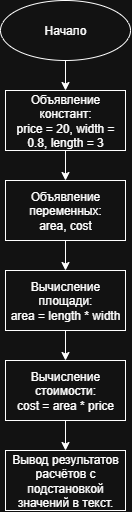

# Домашняя работа к лабораторной работе 2.
## Условия задачи:
В магазине продается костюмная ткань. Ее цена В рублей за кв. Метр. Напишите
программу, которая подсчитает и выведет на экран стоимость куска этой ткани длиной
х м и шириной 80 см.
## Алгоритм и блок схема:
### Алгоритм:
1. **Начало**
2. Объявить константы:
   - `price` = 20 (рублей) стоимость 1 кв. м. ткани
   - `wideth` = 20 (метров) ширина покупаемой ткани
   - `length` = 80 (метров) длина покупаемой ткани
3. Задать исходные данные:
   - `area` = размер покупаемой ткани
   - `cost` = цена покупаемой ткани 
4. Вычислить площадь покупаемой ткани:
   - `area` = `wideth` * `length`
5. Вычислить цену покупаемой ткани:
   - `cost` = `area` * `price`
6. Вывести результаты расчётов с подстановкой значений в текст.
7. **Конец**

### Блок схема

